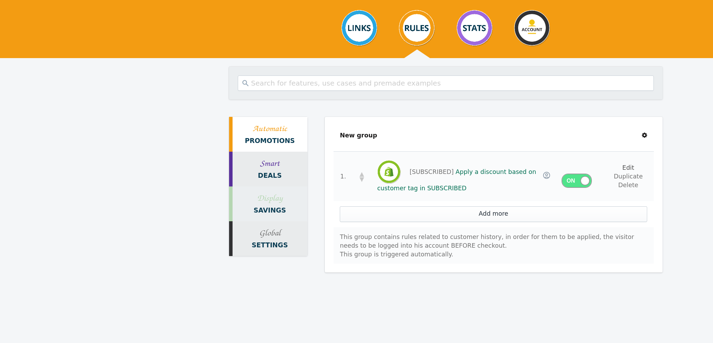

## Implementation:

### Shopify

When creating a customer I pass along the tag: subscribed.
Based on this tag we made an customer group(SUBSCRIBED).
Because shopify didn't allow us to apply a automatic discount on a customer group,
we ended up using the 'Automatic Discount & Gift' shopify app.

### Caveats:

-   I ended up committing the shopify credentials accidentally, so they're still in the git history(Not best practice!)

For this exercise you will be integrating the shopify api into one of our api endpoints.

## Use Case:

We will like to provide shopify discounts to customers that have an active subscription.
Customer with

## To Test:

Its best to use the 2 unit-tests to test the possible cases. Notes are include to help in the process.
To run the test from your cli you can run `yarn test` or `jest test`. If you need to setup with your IDE to be-able to
debug step ensure that you set the jest config file to `./jest.config.js`

## Database:

There is a schema.graphql file that you can use to analyze the graphql schema. You really only need to be concerned
by the following tables

`subscriptions`

`users` (for parents)

`students` (for students)

If you use something like Intellij/Webstorm you can use the included GraphQL plugin to process this file. This
repo contains all the information for that already (`.graphqlconfig`) . If you use VS code you may need to reference
https://marketplace.visualstudio.com/items?itemName=kumar-harsh.graphql-for-vscode to use the graphql schema included
(`schema.graphql`). You can always use outside tools to examine the schema. This is all to provide you with typehints
in the query. The repo has example queries for all the fetch queries you will need. You will only need to create the
update queries. To update either the `students` table or `users` table where needed.

## Gotchas

The project uses the serverless framework. You will notice that we have provided the definitions for all the handlers
needed. Ensure that if you need to add custom changes such as envs that they are declared in the serverless.yml
and/or handler yml file as needed.

## Hint

1. There is one approach that can allow you to do most of the setup within shopify dashboard and have very little
   api calls to shopify api done in the application it self. In this approach you may only need to create customer, flag it as subscribed in some way and handle syncing the subscription state.
2. There are two handlers that will control the shopify parts
3. remote-schema/mutations/purchasePlan.ts
    1. This is the entry point for when a subscription is created
4. hasura-hooks/subscriptions/onSubscriptionUpdated.ts
    1. this is the entry point for when subscription ANY of the subscription data has changed
    2. be wise to check for change (see unit-test)
5. A good starting point would be this api doc https://shopify.dev/docs/admin-api/rest/reference/discounts/pricerule
